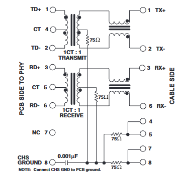

# Building a EaserCAT board

## Parts

Most parts are generic and can be found in many places. SMD resistors and capacitors are standard, nothing special.

Crystals are standard type hc49/s.

In case of smd crystal then it's a "passive smd crystal 3225"

For ferrite beads marked BLM18EG221SN1D - you can use any generic "ferrite bead 220 Ohm 0603 1ln". Not sure if 1ln is important nor what it means. In the schematics some are called BLM18EG221SN1D, others are called BLM18EG221S. It is the same, just a mistake in the naming. 

RJ45 connectors must include "magnetics" and be configured in this way\
\
I have used PulseJack JN0011D01BNL (and most likely a chinese knockoff) and it works fine, but any jack that meets the diagram above will work.

The EtherCAT ICs are from aliexpress. There are quite a few sellers that has the LAN9252i/PT and the Ax58100 (LAN9252/PT and LAN9252V/PT are also possible, temperature range differs). Afaik, there is only one variant of the Ax58100 - AX58100LT. The LAN9252 is generally avialable, the Ax58100 is more of a challenge but check aliexpress.

The pcb needs to be ordered. Consider using a solder stencil - but hey it's up to you. I have bought pcbs from some chinese factories and from Aisler, Germany. The Aisler pcb is the nicest and came with excellent solder stencil. At a bit higher cost, nothing dramatic though. If you are hunting pennies then go to one of the chinese ones, maybe check prices at https://pcbshopper.com.

## EEPROM

You need to fill the EEPROM with valid contents before putting it on the pcb. It  is actually a must, the EtherCAT IC will not start with an empty EEPROM, or with a non-valid content. It doesn't have to be for a real EtherCAT slave, because the first thing you will do when the card works is to upload the correct contents using TwinCAT. Any valid EEPROM content.

There is a small Arduino program [Link here](Utils/EEPROM_generator/) that helps to fill the empty EEPROM. Follow the link.

## Populating the pcb

Enjoy!

## Soldering

I have put the pcb in the soldering oven. Hand soldering should work, although the pin spacing is only 0.4 m on the Ax58100 IC and can be a challenge.

## Powering up

Connect the STLINK/V2 unit and the serial port. The serial port will provide 5V, you don't need to see the serial output (there isn't any).

Ax58100\
Red led status - Blinking pattern means succesful read of eeprom
Gree led status - Blinking pattern indicates EtherCAT state (init, op, etc.)

LAN9252\
There is no indication.

## Hookup to TwinCAT

Install TwinCAT/XAE\
Ethernet cable\
Network interface assignment\
scan\
free-run\
download EEPROM contents

## Build and download firmware

vscode\
platformio\
open folder\
Build and upload\

## Twincat verification

## Linuxcnc

## Modifying the firmware