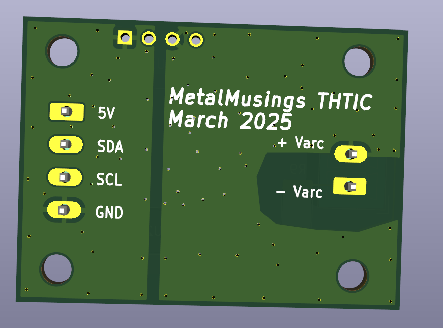
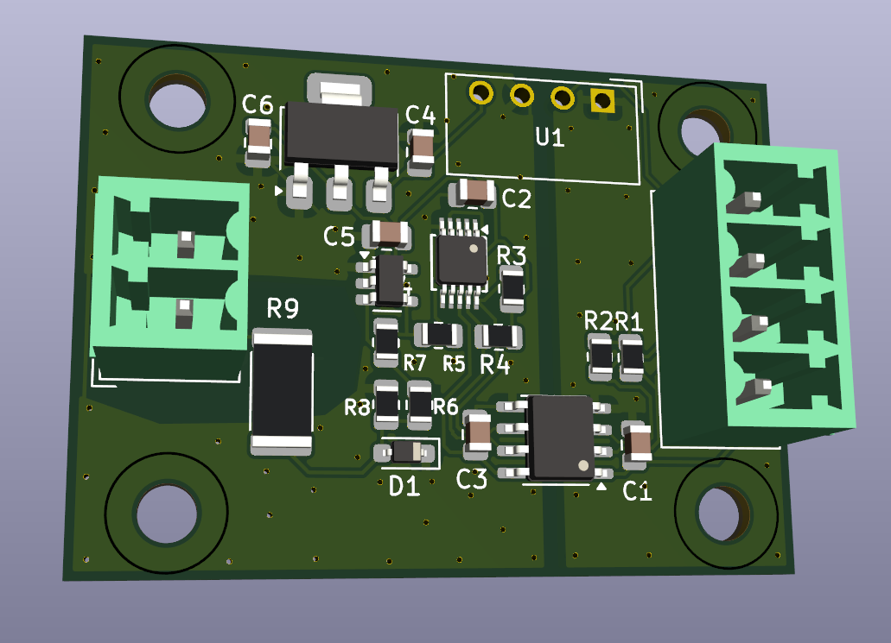

# MetalMusings EtherCAT device

This repository contains the EtherCAT devices I have designed, built and put in use in linuxcnc.

Everything should be here: 
- Schematics, PCB layouts, and what is needed to build the boards.
- Software tools to create an ESI-file and program the ESC eeprom. 
- Software tools to create the application running on a STM32F407VG.
- A big learning curve is hidden in here as well

I have (so far) used two different ESC ICs: LAN9252 and Ax58100. 
Both work, I can't really see a difference. 
The Ax58100 has a leg spacing of 0.4 mm, 0.5 mm for the LAN9252, if that matters.
On paper the Ax58100 has more builtin functionality like stepper motor drivers,
but the documentation is lacking. Or my understanding of the documentation is lacking.
The Ax58100 supposedly has more efficient access to registers and data.
The indirection scheme is the main objection to using LAN9252, I have read.
The LAN9252 is the true and tested IC of the two. If you don't know, go for the LAN9252.

The EtherCAT cards, which I call EaserCAT cards, use an EtherCAT chip and a normal MCU.
I have used the STM32F407VGT6. The EaserCAT chip does the network talk and other 
EtherCAT things. The STM32 does the application things, like reading and setting pins high or low,
reading encoder inputs, generate stepper motor pulses and other interesting applications one can think of.
There is a narrow interface between the two: SPI and a couple of lines for synchronization.
Any decent MCU can do that, it doesn't have to be a STM32F407VGT6. I have tested with a esp32 with success.
Feel free to experiment with other processors.

I learned most of what I know about EtherCAT through a number of Youtube videos I made.
There are accompanying git branches. For example, for video 8 you can check out the
Video8 branch to get the software tree in the state at the video.
More info on the videos, which are now more of historical interest, but also a bit of learning by following [this link](Videos.md)

And of course, this work builds on the work of many others. This would not be possible without their work. 
I'm just reusing what they did and maybe expanding on it.

Here is the start of [building instructions](Build.md)

## EaserCAT 2000 - a testbench for ESC+MCU, SOES, stepper generator, linuxcnc

This was the first card that got used in Linuxcnc. Follow [link here](Cards/EaserCAT-2000/)
I think I got it working pretty well in the end. There was, and still is, an issue with
synchronization between the linuxcnc servo-loop and the ESC DC loop.
I don't remember the status of it anymore, it was some time ago I worked with it.
The main thing was that it lacked optocouplers and isolation for the external signals.

## EaserCAT 3000 - All in one board with Ax58100

This card is an evolution of the EaserCAT 2000 and was intended to be used in my plasma cutter.
It features four stepper driver outputs, input for a THCAD arc voltage card, an encoder, 
an analog output (for spindle +- 10V), eight digital inputs, four digital outputs, 
plus some 12 I/O for any possible extension. The IOs are isolated from the MCU.

However, I couldn't get this card to work, almost at all. The Ax58100 didn't even load the eeprom. 
Struggling with the documentation for the Ax58100, which formed my negative opinion about that,
I gave up and let it sit for over half a year. It was first when someone came and asked 
questions around it I had another look. I built a new board, and it all started to work.
At time of writing it all seems to work.

The latest vesion of the firmware has all parameters for step generators as PDOs.

[Link here](Cards/EaserCAT-3000-Digital-Stepper-Analog-Encoder-Frequency/)

## EaserCAT 4000 - THCAD reader

Faced with the problems with the EaserCAT 3000 board, and still wanting to use EtherCAT 
in my upcoming plasma cutter, I made this board whos single purpose is to read 
the PWM frequency from Mesa's THCAD board.\
The THCAD board reads the voltage between 
the plasma torch and the workpiece which is around 100V. Highly isolated, and with 
a voltage to frequency converter it delivers a differential pwm signal. 
The frequency of this signal can be related to the voltage.\
That's what is needed for linuxcnc torch height control.

In the tests on the bench this can read at least up to 200 kHz, but its's better to be below 100 kHz.
The THCAD has a frequency divider one can set to make the frequency range nicely match this.
It seems to work fine so far. 
Implementation is with interrupts. \
A better option would have been to use TIM2's PWM_INPUT function, which can work with several MHz frequency. 
I tried the PWM_INPUT method a lot but couldn't get it to work. The current method still works, though.
If time and interests are in phase with the moon, I might look at PWM_INPUT again.

This board is now relegated to history, replaced by the EaserCAT-6000.

[Link here](Cards/EaserCAT-4000-THCAD-Reader/)

## EaserCAT 5000 - Digital IO without MCU

A card just doing Digital Input and Digital Output. The intentions were to read 
limit switches and some other switches around the plasma torch. And to switch on the plasma torch.
It's a single LAN9252, configured for local IO. Optocouplers are attached to IO pins for isolation.
It has been tested on the bench, it works with TwinCAT.

HOWEVER, it doesn't work, and will not work, with linuxcnc. As I've learned,
the IgH EtherCAT master needs a CoE client (CANopen over EtherCAT).
The LAN9252 in DIO mode is only an EtherCAT client and can't be turned
into a CoE client. And the IgH EtherCAT application interface for real-time
communication can not be downgraded to work with a pure EtherCAT client,
it requires a CoE client.

To add CoE functionality means to add number of objects at certain positions
in the client and that can not be done to the LAN9252. It is what it is.
In a setup with LAN9252 with MCU, those objects are created in the firmware,
so there it works.

This board is now relegated to history, replaced by the EaserCAT-6000.

## EaserCAT 6000 - Digital IO and frequency input

Finally, a card that's actually used in a real system. This card is used in my plasma cutter. 
It has 12 digital inputs, 4 digital outputs and a frequency counter to get
the input from Mesa's THCAD (reader of voltage between plasma nozzle and workpiece).\
All digital IOs are opto-isolated and the frequency input uses a RS-485 receiver.

In the plasma cutter, it does the job. There are three ECT60 stepper motor drivers.
And the EaserCAT-6000 card. It handles limit switches for X, Y and Z, floating switch,
break-away switch, and plasma Arc OK signal. There is room for e-stop and other switches.\
The plasma torch is switched on using one of the digital outputs.\
THCAD is an older model with full voltage input. Frequency divider is set to 1/32.

This board replaces EaserCAT-4000 and EaserCAT-5000. 

[Link here](Cards/EaserCAT-6000-THCAD-reader+Digital-IO/)

A few weeks later and I've used this card in the plasma cutter for quite a bit of cutting and it hasn't missed a beat. Works so well. THC follows the sheet surface up and down. Awesome.

## EaserCAT Torch Height Control - EaserCAT 7000 with THTIC and THTIC2

Actually something useful again - not one, but two, plasma torch voltage readers.
They replace the THCAD board and comes with the entire chain from voltage reading to the introduction of a calibrated voltage to linuxcnc for use in QtPlasmaC. 

Let's start with the plasma cutter. There is either a THTIC or THTIC2 mini-board, which reads the plasma torch voltage, and through a voltage divider lowers it to about 2 Volts during cutting. This voltage is converted by an analog to digital converter and feeds the digitized voltage to the EaserCAT 7000 board via an I2C bus (cable). The EaserCAT 7000 board makes the voltage available both as the raw read voltage for further scaling, or as a calibrated voltage using entered calibration constants.

The plasma torch voltage is DCEN - DC Electrode Negative. The workpiece ground is often connected to ground/earth.
With ground as the reference voltage, the plasma torch voltage ranges between 0 V and -200 V.
An inverting operational amplifier switches the polarity for the ADC. The ground planes on the circuit board are connected to the workpiece ground.

An important feature of THCTIC and THCTIC2 is that the plasma voltage side is isolated from the linuxcnc signal side. The isolation level is better than 1.5 kV. This is achieved by an I2C isolator and an isolated DC-DC converter. The difference between the two cards is the choice of ADC. THTIC uses MCP3221 and THTIC2 uses ADS1014. Both are 12-bit analog to digital converters, ADS1014 is perhaps an 11-bit, both with sampling rates around 3 kHz. A newly measured voltage value can be obtained every 1 ms. Of course you only choose one of the two. Since it seemed pretty easy when I did it, I made two different ones. Always good to have options.

The boards are relatively small, 42x30 mm. Voltage 5V in, current less than 10 mA. I2C Data and clock. 

### THTIC
 

### THTIC2
 

### EaserCAT-7000 Digital IO and I2C voltage reader

EaserCAT-7000 is an EaserCAT-6000 board where the THCAD frequency input has been replaced by the I2C bus.
There are twelve digital inputs and four digital outputs.

Configuration of the connected I2C device is done with the two SDOs 0x2000:0 and 0x2001:0.\
The I2C device type is set to 0 by default. A zero means no I2C ADC. Entering a 1 in 0x2000:0 selects the MCP3221, and a 2 in 0x2000:0 selects the ADS1014.\
The I2C address for the ADC is written into SDO 0x2001:0. The address for the MCP3221 is selected when it is purchased - there are 8 different models each with a different I2C address 0x48-0x4f. The ADS1014 has a way to select the address, but the THTIC2 board has it fixed at 0x48.

Pay attention to the polarity when connecting the plasma voltage leads the THTIC and THTIC2. Varc+ must have higher voltage potential the Varc- (as one would expect). The voltage divisor may need to be adjusted, there is now one 100 kOhm resistor and a 2.2 kOhm resistor, which brings down 100 V to around 2 V. Adjust as needed. For high voltage, pay attention to the max allowed voltage of the resistor. The ADC likes to have around 2-3 Volts when cutting.

The experience with these cards has been very good so far. I have used the THTIC the most, cutting for at least an hour of cutting time, with THC enabled and active. A status variable shows that it has been working the whole time, no stops or resets. The THTIC2 has been used much less, but it behaves the same as the THTIC card, meaning it just works.

## THCLIP Enable ohmic sensing with the IPTM-60 torch

This is for the torches known as IPT-60 PT-60 S45 IPTM-60 IPTM-80 and many more that have blowback start with the torch tip exposed and normally shortened to the torch electrode. Normally this torch can't use ohmic sensing since all parts are connected to ground. At least on my machine, a Herocut 8000, the blowback start cable from the torch can be cut during sensing. This enables ohmic sensing and it continues to operate in other situations.

I have made an adaptation to the EaserCAT 7000 to handle the contact. There is a short setup time needed to make sure the relay is activated before starting to watch for contact, a tenth of a second seems enough. Then it watches for a shift from some 7V to a settable limit, say 4V, to indicate contact. Works like a charm.

The Trafimet torch hose connectors are called FY0022 and FY0023. The relay is a 24V 40A standard car relay. Check out the Kicad schematics for the other parts.

## License

Don't violate the original licenses. No warranties. Use it any way you like.\
Remember: It is a hobby project, not a product.
